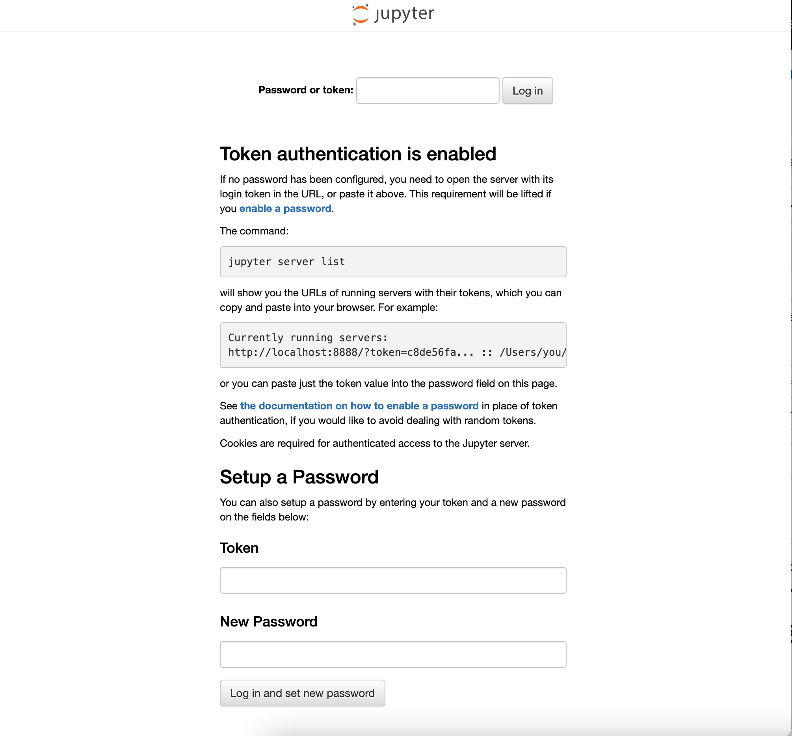

# 概要
- pythonでchatGPTを使ったプログラムを作成する
- あると便利そうなので、jupyterlabも入れてしまう

# 前提条件
- dokcer-composeが動くこと

# 手順
- OpenAIの公式ページにアクセスして、アカウント登録をする
- 登録後、APIシークレットキーとOrganizationIDをメモしておく
- work直下にsettingディレクトリを作成し、その直下にconfig.pyという名前のファイルを作成して、下記のようにする
```
OPENAI_API_KEY = "メモしておいたAPIキー"
OPENAI_ORGANIZATION_ID = "メモしておいたOrganizationID"
```
- ターミナルを立ち上げてdocker-compose.ymlのあるファイルまで移動して下記コマンドを実行
```
docker-compose up -d --build
```
- 下記コマンドでコンテナの中に入る
```
docker exec -it jupyterlab-test bash
```

- 下記コマンドを実行し、chatGPTに質問を投げる(ファイル名の後に聞きたいことを聞く)
```
python3 chatbot.py phpを作った人は？
```

# (おまけ)jupyterlabへのアクセス
- (http://localhost:8888/)にアクセスするとログイン画面が出てくる



